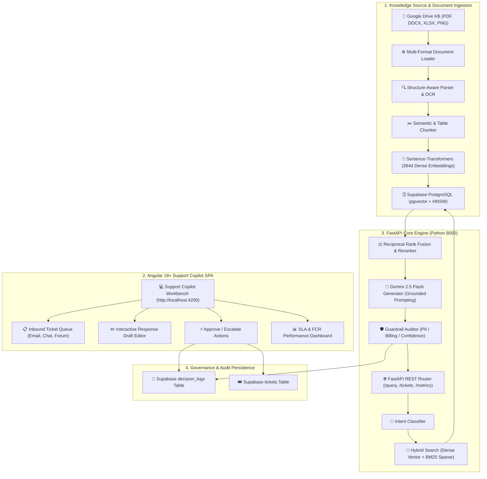
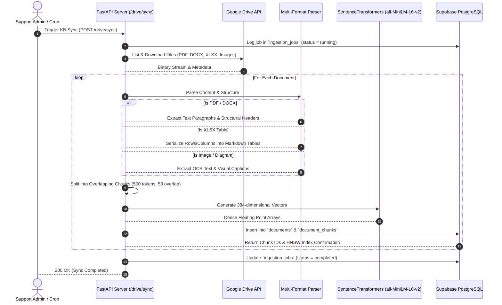
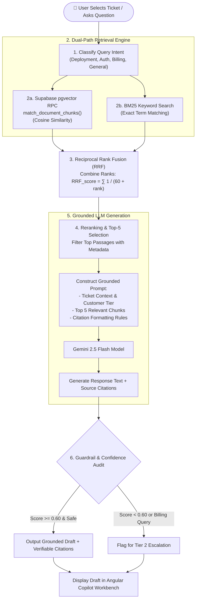
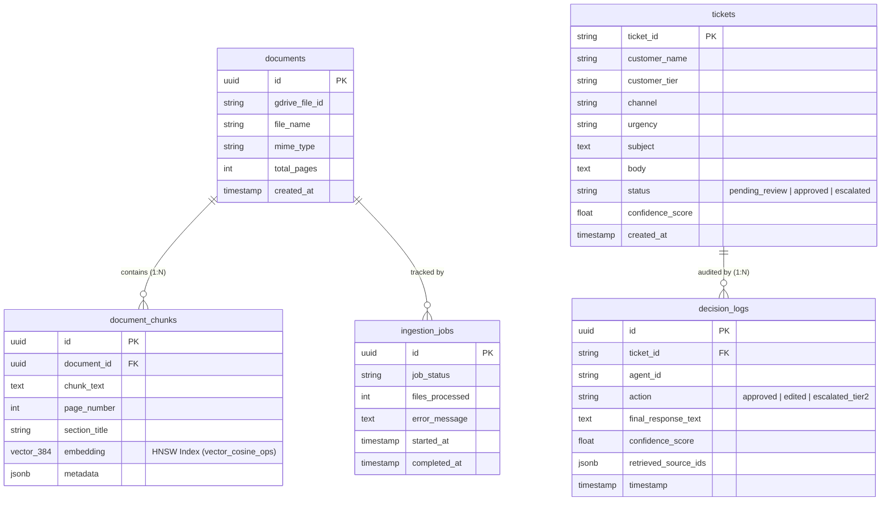

# Multimodal RAG & Support Copilot — Complete System Flow Diagrams

This document presents the complete end-to-end architecture, data processing pipelines, query execution flows, governance states, and database relationships for the **Multimodal RAG System & Support Copilot Workbench**.


---

## 1. High-Level End-to-End Architecture Flow

The following diagram illustrates the complete workflow from raw document ingestion in Google Drive to Tier 1 agent triage and decision logging in Supabase PostgreSQL.



---

## 2. Detailed Knowledge Base Ingestion Flow

This sequence shows how raw multi-modal files (PDFs, Tables, DOCX, Images) are fetched from Google Drive, processed, embedded, and stored in vector indices.



---

## 3. Copilot Query & Hybrid RAG Retrieval Flow

This diagram details the real-time query execution pipeline, combining dense vector semantic search with sparse BM25 keyword matching and LLM response generation with verifiable citations.



---

## 4. Human-in-the-Loop (HITL) Workbench & Governance Flow

State transitions for inbound support tickets, agent actions, and governance audit logging.

```mermaid
stateDiagram-v2
    [*] --> New: Inbound Ticket Creation (Email / Chat / Forum)
    
    New --> PendingReview: Automatically Ingested into Copilot Queue
    
    state PendingReview {
        [*] --> RAGGeneration: Hybrid Vector Search & Gemini Synthesis
        RAGGeneration --> DraftReady: Render AI Draft + Citations
        
        state DraftReady {
            DraftReady --> EditingMode: Agent Clicks 'Edit Draft'
            EditingMode --> DraftReady: Agent Saves Custom Changes
        }
    }
    
    PendingReview --> Approved: Agent Clicks 'Approve & Send'
    PendingReview --> Escalated: Agent Clicks 'Escalate to Tier 2'
    
    state Approved {
        [*] --> DispatchedToCustomer: Response Sent to Customer
        [*] --> AuditLoggedApproved: Logged in decision_logs (action = approved)
    }
    
    state Escalated {
        [*] --> ContextPackageDrawer: Generate Context Package Handoff
        [*] --> AuditLoggedEscalated: Logged in decision_logs (action = escalated_tier2)
    }

    Approved --> [*]
    Escalated --> [*]
```

---

## 5. Database Schema Entity-Relationship Diagram (ERD)

The database schema hosted on **Supabase PostgreSQL** (`pgvector` enabled) powering vector indexing, ticket states, and governance audit trails.



---

## 6. System Interaction Matrix

| Component | Port / Endpoint | Primary Function | Connected Dependencies |
| :--- | :--- | :--- | :--- |
| **Angular SPA** | `http://localhost:4200` | Support Copilot Workbench UI | FastAPI Backend (`http://localhost:8000`) |
| **FastAPI Core** | `http://localhost:8000` | REST API Router & RAG Pipeline | Supabase PostgreSQL, Gemini API, SentenceTransformers |
| **Supabase PostgreSQL** | `rsvyeeepjjlehqkbmcuk.supabase.co` | Vector Search & Metadata Database | `pgvector` HNSW index, `match_document_chunks` RPC |
| **Gemini 2.5 Flash** | Cloud API | Grounded LLM Response Generation | `google-generativeai` SDK |
| **SentenceTransformers** | Local (`all-MiniLM-L6-v2`) | 384-dimensional Dense Text Embeddings | PyTorch CPU runtime |
