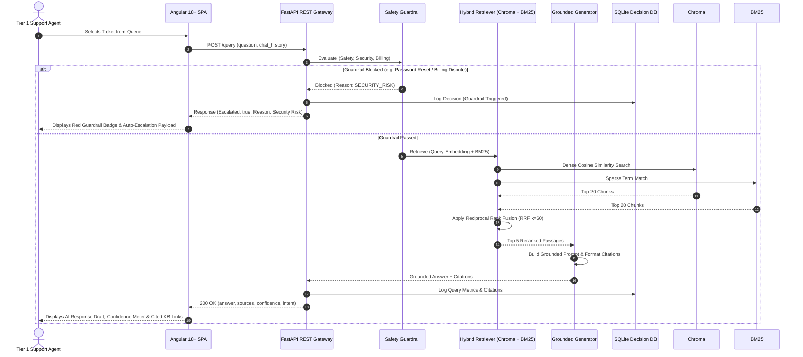

# High-Level Design (HLD) Document
## Intelligent Customer Support Automation System — CloudServe Solutions

- **Document Version**: 2.0
- **Architectural Pattern**: Modular Monolith API (Python FastAPI) + Micro-Frontend SPA (Angular 18+)

---

## 1. Subsystem Decomposition & Boundaries

```mermaid
flowchart LR
    subgraph ClientSubsystem [Subsystem 1: Angular 18+ SPA]
        QueueModule[Ticket Queue Component]
        CopilotModule[Copilot Workbench Component]
        AnalyticsModule[Analytics Component]
    end

    subgraph APISubsystem [Subsystem 2: FastAPI Gateway]
        RESTRouter[FastAPI Router]
        JWTAuth[OAuth2 / Auth Guard]
        LoggerMiddleware[JSON Logger & Metrics Middleware]
    end

    subgraph CoreEngineSubsystem [Subsystem 3: RAG & AI Subsystem]
        IngestionEngine[Ingestion & Hash Pipeline]
        MultimodalParsers[PyMuPDF / pdfplumber / Docx Parsers]
        HybridRetriever[Dense Vector + BM25 RRF Retriever]
        GuardrailSubsystem[Safety & Escalation Guardrail Engine]
        LLMGenerator[Gemini / OpenAI Generator]
    end

    subgraph StorageSubsystem [Subsystem 4: Data & Vector Persistence]
        Supabase[(Supabase PostgreSQL + pgvector HNSW Index)]
        BM25Corpus[(BM25 Sparse Index)]
        MetadataTables[(documents, document_chunks, ingestion_jobs, tickets, decision_logs)]
    end

    ClientSubsystem -->|HTTPS REST / JSON| APISubsystem
    APISubsystem --> CoreEngineSubsystem
    CoreEngineSubsystem --> StorageSubsystem
```



---

## 2. Sequence Diagrams

### 2.1 End-to-End RAG Query & Copilot Draft Generation Sequence



---

## 3. Angular 18+ SPA Copilot Layout Architecture

```
+---------------------------------------------------------------------------------------------------+
| CloudServe Support Copilot | Queue | Copilot Workbench | Analytics | Agent: Sofia (Tier 1)         |
+-------------------------------------------------------+-------------------------------------------+
| TICKET QUEUE (Filtered by Email / Chat / API / Forum) | COPILOT WORKBENCH                         |
+-------------------------------------------------------+-------------------------------------------+
| [TICK-102] Invalid credential error on login          | TICKET ID: TICK-102                       |
| Channel: Live Chat | Priority: HIGH | SLA: 12m        | Channel: Live Chat | Customer: Acme Corp   |
| Customer: "Console returns Invalid credentials..."    |                                           |
| Status: AI Draft Ready (Confidence: 92%)              | CUSTOMER INQUIRY:                         |
|-------------------------------------------------------| "I am getting Invalid credentials on      |
| [TICK-103] Container health check timeout             | login despite correct password."          |
| Channel: Email | Priority: CRITICAL | SLA: 45m        |                                           |
| Customer: "Deployment reaches running and rolls..."   |-------------------------------------------|
| Status: AI Draft Ready (Confidence: 88%)              | AI DRAFT RESPONSE (Grounded):              |
|-------------------------------------------------------| "Based on DOC-AUTH-001 [1], common causes |
| [TICK-104] Billing refund request for Q2              | are account lockouts after 5 failed       |
| Channel: Email | Priority: HIGH | SLA: 2h         | attempts or stale session cookies.        |
| Status: GUARDRAIL BLOCKED (Billing Dispute)           |                                           |
|                                                       | Resolution: Confirm if account is locked  |
|                                                       | or clear cookies [1]."                    |
|                                                       |                                           |
|                                                       | CITATIONS:                                |
|                                                       | [1] DOC-AUTH-001: Resolving invalid       |
|                                                       |     credential errors (Page 1)            |
|                                                       |-------------------------------------------|
|                                                       | ACTIONS:                                  |
|                                                       | [ Approve & Send ] [ Edit ] [ Escalate ]  |
+-------------------------------------------------------+-------------------------------------------+
```

---

## 4. Key Subsystem Interfaces

1. **`IngestionSubsystem`**: Discovers files, calculates MD5 hashes, parses PDFs/DOCX/XLSX, extracts tables/diagrams, and indexes chunks into ChromaDB and BM25.
2. **`RetrievalSubsystem`**: Classifies intent (`table_query`, `diagram_query`, `exact_lookup`), rewrites follow-up questions, executes hybrid dense+sparse RRF search, and reranks passages.
3. **`GenerationSubsystem`**: Formats grounded prompt, invokes LLM (Gemini 2.5 Flash / OpenAI), builds verifiable source citations, and handles chat context memory.
4. **`CopilotUISubsystem`**: Modern Angular 18+ SPA facilitating 1-click agent reviews, edits, approvals, and escalations.
