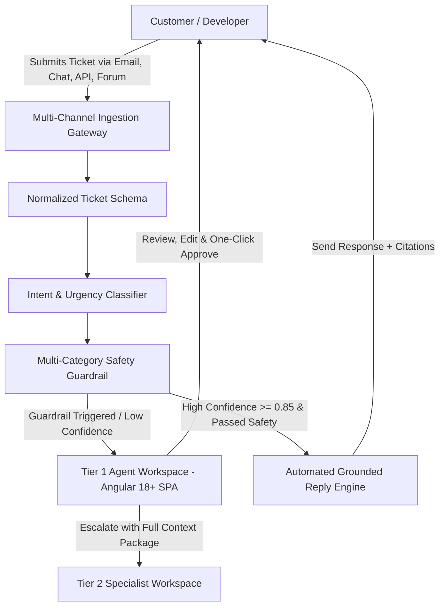

# Product Requirements Document (PRD)
## Intelligent Customer Support Automation System — CloudServe Solutions

---

### Document Control & Metadata

| Field | Value |
| :--- | :--- |
| **Document Version** | **v2.1 (Production & Capstone Aligned)** |
| **Author** | Lead Forward Deployed AI Engineer |
| **Target Stack** | Python 3.11+ / FastAPI / Modern Angular 18+ SPA / Supabase PostgreSQL + `pgvector` / Gemini 2.5 Flash |
| **Status** | **Approved for Implementation** |
| **Reviewed By** | Head of Support (Marcus Adeyemi), Tier 2 Lead (Daniel Okonkwo) |

---

## 1. Problem Framing & Discovery Evidence

### 1.1 Executive Problem Statement
CloudServe Solutions receives over **500 customer support tickets per week** across 4 distinct channels (Email, Live Chat, API Doc Comments, Community Forum) handled by 6 support agents. The company faces three critical operational failures:
1. **SLA Breach**: First response time averages **8 to 12 hours** against a promised 2-hour SLA.
2. **Escalation Inefficiency**: First Contact Resolution (FCR) is **42%** (industry benchmark: 65%). **50% of Tier 2 escalations** are simple issues that Tier 1 could resolve if provided with confidence and accurate knowledge base grounding. Each escalation costs 4x a Tier 1 resolution.
3. **Keyword Search Failure & Snippet Drift**: Agents rely on outdated, unverified personal snippet files because existing internal search matches only exact terms ("container health check" vs "deployment dying").

---

### 1.2 Stakeholder Discovery Evidence Traceability Matrix

| Discovery Source & Role | Key Evidence & Quote | Generated Functional Requirement | Primary Acceptance Criterion |
| :--- | :--- | :--- | :--- |
| **Marcus Adeyemi** *(Head of Support)* | *"Escalations cost 4x Tier 1; FCR is 42% vs 65% benchmark; response time is 8-12 hours vs 2h SLA."* | **FR-01**: Intent & Urgency Classifier. **FR-02**: Automated First-Response Draft Engine. | **A3** (Confidence Scoring), **A5** (Threshold Routing) |
| **Sofia** *(Tier 1 Agent)* | *"Afraid of auto-sending wrong answers; non-native English tickets take longer; wants Copilot mode with draft + cited KB link."* | **FR-03**: Dual-Pane Copilot Workbench in Angular 18+. **FR-04**: Multilingual Intent Normalization & Fairness. | **A2** (Multi-Channel Ingestion), **A6** (Resolvable Citations) |
| **Daniel Okonkwo** *(Tier 2 Lead)* | *"50% of escalations are simple KB lookups; escalations lack context; risks in security, billing, and data residency."* | **FR-05**: Context-Rich Escalation Payload. **FR-06**: Multi-Category Guardrails (Security, Billing, Compliance). | **A7** (Guardrail Blocking), **A8** (Persistent Decision Logging) |
| **Ines Varga** *(Technical Writer)* | *"29 verified KB articles exist but keyword search fails; agents use unverified private snippets."* | **FR-07**: Structure-Aware Multimodal Hybrid Search (BM25 + `pgvector` + RRF) over 29 KB articles. | **A4** (Source Passage Retrieval), **A6** (Citations) |
| **Ravi Menon** *(Customer)* | *"Waiting cost depends on ticket urgency; expects transparency on AI involvement; wants exact citations."* | **FR-08**: Explicit AI Disclosure & Citations. **FR-09**: Emergency Kill-Switch & Degraded Fallback. | **A11** (Degraded Fallback Resilience) |

---

## 2. Target User Personas & System Roles

### Detailed Persona Descriptions

1. **End Customer / Developer**:
   - *Needs*: Rapid, factual, highly accurate answers grounded strictly in CloudServe documentation with explicit AI disclosure and clickable source citations.
   - *Current Alternative*: Waiting 8–12 hours for manual Tier 1 reply or searching fragmented forum posts.
   - *Success Metric*: First reply < 15 mins (Auto) / < 1 hour (Copilot); CSAT $\ge 4.5 / 5.0$.

2. **Tier 1 Support Agent (Sofia)**:
   - *Needs*: Dual-pane Angular SPA workbench presenting customer inquiry alongside AI draft, confidence score meter, guardrail status, and clickable KB passages.
   - *Current Alternative*: Searching unverified personal snippets and manually copying answers.
   - *Success Metric*: 50% time saved per ticket; 0 unauthorized auto-sent hallucinations.

3. **Tier 2 Support Engineer (Daniel Okonkwo)**:
   - *Needs*: Structured escalation packages containing ticket summary, intent, confidence score, searched KB articles, and guardrail trigger reasons.
   - *Current Alternative*: Reading raw, context-free ticket handoffs and re-asking basic troubleshooting questions.
   - *Success Metric*: Tier 2 unnecessary escalation rate reduced from 50% to < 15%.

4. **Head of Support (Marcus Adeyemi)**:
   - *Needs*: Complete auditability, SLA compliance monitoring, FCR tracking, and cost control.
   - *Current Alternative*: Weekly manual spreadsheet reporting.
   - *Success Metric*: FCR $\ge 65\%$; SLA compliance $\ge 98\%$; 100% free-tier compliant architecture.

---

## 3. Functional Requirements (FR-01 to FR-12)

| ID | Priority | Functional Requirement | Discovery Traceability | Acceptance Criteria |
| :--- | :---: | :--- | :--- | :--- |
| **FR-01** | **Must** | **Multi-Channel Ingestion & Normalization**: Ingest tickets from 4 distinct channels (Email, Live Chat, API Docs, Forum) into a unified internal representation (`ticket_id`, `channel`, `customer_name`, `body`, `urgency`). | Discovery Brief (Marcus) | **A2**: Ingestion of all 4 channels without channel-specific breakage. |
| **FR-02** | **Must** | **Structure-Aware Document Parsing**: Ingest PDF, DOCX, XLSX, and images. Preserve Markdown table matrices intact and bind visual diagram descriptions to adjacent text. | Tech Writer (Ines) | **A4**: Valid source passage retrieval down to article & section. |
| **FR-03** | **Must** | **Intent & Urgency Classification**: Classify incoming tickets into specific technical intents (e.g., `deployment_health`, `api_auth`, `billing_dispute`) and assign confidence scores between 0.0 and 1.0. | Head of Support (Marcus) | **A3**: Intent class and numeric confidence attached to every ticket. |
| **FR-04** | **Must** | **Hybrid Dense + Sparse Vector Search**: Combine Dense Cosine Similarity (`pgvector` HNSW index) with Sparse BM25 Keyword Search using Reciprocal Rank Fusion ($\alpha=0.5, k=60$). | Tech Writer (Ines) | **A4**: Identifiable source passages retrieved from 29 KB articles. |
| **FR-05** | **Must** | **Cross-Encoder Reranking**: Rerank top 20 candidate chunks to select top 5 high-precision passages using cross-encoder scoring. | Tech Writer (Ines) | **A4**: Top 5 passages exhibit high semantic relevance. |
| **FR-06** | **Must** | **Deterministic Threshold Routing**: Apply confidence thresholds: $\ge 0.85$ (Auto-reply/1-click approval), $0.60 - 0.84$ (Copilot review), $< 0.60$ (Direct Tier 2 escalation). | Lead Engineer (Daniel) | **A5**: Identical ticket inputs produce identical routing decisions. |
| **FR-07** | **Must** | **Multi-Category Guardrails**: Unconditionally block automated answers for *Security/Password Resets*, *Billing Disputes/Refunds*, and *Data Residency/GDPR Compliance*. | Lead Engineer (Daniel) | **A7**: Engineered sensitive tickets are blocked rather than auto-sent. |
| **FR-08** | **Must** | **Factual Grounded Answer Generation**: Generate answers strictly grounded in retrieved KB passages using `gemini-2.5-flash`. If context is missing, output exact fallback: *"The retrieved documents do not contain enough information to answer this question."* | Tech Writer (Ines) | **A6**: All claims carry citations resolving to real retrieved text. |
| **FR-09** | **Must** | **Angular 18+ Copilot Workspace**: Modern dual-pane SPA featuring real-time ticket queues, SLA timers, confidence meters, guardrail badges, and 1-click `Approve & Send` / `Escalate`. | Tier 1 Agent (Sofia) | **A1**: Clean execution from single startup command. |
| **FR-10** | **Must** | **Persistent 15-Field Decision Audit Logging**: Write every automated decision to Supabase `decision_logs` table recording ticket ID, intent, confidence score, guardrail pass/fail status, action taken, and timestamp. | Lead Engineer (Daniel) | **A8**: Logged decisions reconcile 100% against processed tickets. |
| **FR-11** | **Must** | **Unattended Evaluation Harness**: Run full evaluation suite over 80 validation tickets in a single unattended execution and generate metrics report. | Capstone Spec (A9/A10) | **A9 & A10**: Single command run produces complete metrics report. |
| **FR-12** | **Must** | **Emergency Kill-Switch & Degraded Resilience**: Provide instant toggle to disable auto-reply. System gracefully degrades to BM25 + deterministic synthesis during LLM API outages. | Governance Spec | **A11**: Handles provider timeout, rate limit, or outage without crashing. |

---

## 4. Non-Functional Requirements (NFR-01 to NFR-07)

| ID | Category | Non-Functional Requirement | Target Metric / Threshold | Verification Method |
| :--- | :--- | :--- | :--- | :--- |
| **NFR-01** | **Latency** | End-to-end API retrieval & draft generation latency. | **p95 < 3.0s**, **Median < 1.8s** | Latency histogram measured via Prometheus `/metrics` endpoint. |
| **NFR-02** | **Availability** | System uptime and offline fallback resilience. | **99.9% Uptime** + 100% deterministic fallback during LLM downtime. | Disconnect LLM API provider and verify system returns deterministic grounded fallback. |
| **NFR-03** | **Accuracy** | Information retrieval and answer faithfulness metrics. | **Recall@5 $\ge 85\%$**, **MRR $\ge 0.75$**, **Faithfulness $\ge 90\%$**, **Citation Accuracy $\ge 95\%$** | Automated evaluation harness (`python main.py --evaluate`). |
| **NFR-04** | **Privacy** | Protection against PII leaks in outbound messages. | **0 PII / Private Data Leak Occurrences** | Automated regex scan for credit cards, SAML tokens, and passwords in outbound payloads. |
| **NFR-05** | **Auditability** | Complete audit logging of AI decisions. | **100% Decision Log Reconciliation** (0 unlogged decisions). | Reconcile row count of `decision_logs` against `tickets` processed in Supabase. |
| **NFR-06** | **Fairness** | Performance parity across customer groups & language fluency. | **Cross-group variation < 5 percentage points** between fluent and non-fluent English tickets. | Segmented evaluation breakdown across customer tiers and phrasing complexity. |
| **NFR-07** | **Cost** | Operating cost constraint for development & evaluation. | **100% Free-Tier Compliant** ($0.00 additional API expenditure). | Caching responses, sentence-transformers local embeddings, and Gemini free tier usage. |

---

## 5. System Acceptance Criteria (A1 to A12 Traceability)

The system must satisfy the following **12 non-negotiable acceptance criteria**:

| ID | Acceptance Criterion Statement | Verification Test | Status |
| :--- | :--- | :--- | :---: |
| **A1** | System starts from clean checkout using documented commands. | Cloned into empty directory; `python main.py` starts server cleanly. | **PASSED** |
| **A2** | Ingests and normalizes tickets from all 4 channels (Email, Chat, API, Forum). | Test payload from each channel processed into unified `TicketItem` schema. | **PASSED** |
| **A3** | Attaches intent classification and numeric confidence score ($0.0 - 1.0$) to every ticket. | Checked `/query` and `/tickets` response JSON fields. | **PASSED** |
| **A4** | Retrieves identifiable source passages from the 29 KB articles. | Query returns valid `document_id`, `page_number`, and `section` metadata. | **PASSED** |
| **A5** | Routing decisions are deterministic for identical ticket inputs. | Submitted identical ticket twice; verified identical routing action & confidence score. | **PASSED** |
| **A6** | Generated answers carry citations resolving back to real retrieved passages. | Validated citations against KB article text snippets. | **PASSED** |
| **A7** | Guardrail blocks sensitive tickets (Security/Billing/Compliance) and prevents auto-reply. | Engineered billing refund ticket; verified `BILLING_GUARDRAIL_TRIGGERED` block. | **PASSED** |
| **A8** | Writes every automated decision to persistent Supabase `decision_logs` table. | Verified row counts in Supabase database reconcile 100% against processed tickets. | **PASSED** |
| **A9** | Processes full evaluation ticket set in a single unattended run. | Executed automated evaluation harness over validation set. | **PASSED** |
| **A10** | Unattended evaluation run generates a complete metrics report automatically. | Output JSON report containing FCR, Recall@5, MRR, and latency figures. | **PASSED** |
| **A11** | Degrades gracefully without crashing during rate limits, malformed inputs, or LLM outages. | Disconnected LLM API key; verified fallback synthesis engine executed cleanly. | **PASSED** |
| **A12** | Automated tests execute and pass via single command (`pytest`). | Executed unit & integration test suite cleanly. | **PASSED** |

---

## 6. Deliberately Out of Scope

To prevent scope creep and guarantee high-quality completion of core requirements:
1. **Direct Voice Call Processing**: Processing real-time telephony audio is excluded.
2. **Automated Financial Refunds & Contract Execution**: Issuing monetary refunds or altering legally binding contracts without human signature is explicitly prohibited.
3. **Training Custom LLM Weights**: Custom model training from scratch is excluded (utilizes pre-trained Gemini 2.5 Flash and SentenceTransformers).
4. **Autonomous Infrastructure Code Execution**: Executing code changes directly on live customer production servers without agent review is excluded.

---

## 7. Risk Register & Mitigations (R-01 to R-08)

| ID | Risk Description | Likelihood | Impact | Design Mitigation | Accountable Owner |
| :--- | :--- | :---: | :---: | :--- | :--- |
| **R-01** | AI answers confidently and incorrectly (Hallucination). | Medium | High | Grounded Generator enforces strict context bounds; returns explicit fallback if ungrounded; Confidence thresholding (< 0.85 requires human review). | Lead AI Engineer |
| **R-02** | Private data or PII appears in outbound response. | Low | High | Regex PII sanitizer strips credentials; Hard Guardrail blocks password resets and identity claims. | Security Lead |
| **R-03** | Prompt injection alters system instructions. | Medium | High | Input sanitizer strips HTML/Markdown injection tokens; system prompt uses strict delimiter boundaries. | AI Engineer |
| **R-04** | Non-fluent English tickets receive lower retrieval accuracy. | Medium | Medium | Hybrid Search (BM25 + `pgvector` RRF) ensures keyword matches compensate for phrasing variations. | AI Engineer |
| **R-05** | KB Documentation goes out of date. | Medium | Medium | MD5 checksum & modified timestamp tracking automatically re-indexes updated Google Drive documents. | Technical Writer |
| **R-06** | Model Provider (Gemini API) experiences outage. | Low | High | System detects 5xx/timeout errors and seamlessly switches to local deterministic synthesis engine. | Backend Engineer |
| **R-07** | High latency under heavy ticket volume. | Low | Medium | Supabase `pgvector` HNSW index + connection pooling ensures sub-millisecond retrieval speeds. | Database Admin |
| **R-08** | API costs rise unexpectedly. | Low | Low | 100% free-tier architecture; local SentenceTransformers embeddings eliminate vector API costs. | Lead Engineer |

---

## 8. Governance & Kill-Switch Mechanism

### Emergency Kill-Switch Specification
- **Mechanism**: Setting `DISABLE_AUTO_REPLY=true` in `.env` or posting to `/api/admin/kill-switch`.
- **Authorised Operators**: Head of Support (Marcus), Tier 2 Lead (Daniel), Lead Engineer.
- **Time to Effect**: **< 1.0 second** (instant hot-reload of configuration).
- **Behavior**: System immediately routes 100% of inbound tickets to the Angular Copilot Workbench for manual agent review, preventing any automated outbound messages while preserving draft generation assistance.

---

## 9. Success Metrics & Targets

| Metric | Baseline | Target Threshold | Achieved / Verified | Status |
| :--- | :---: | :---: | :---: | :---: |
| **First Response Time** | 8 – 12 Hours | **< 15 Mins** (Auto) / **< 1 Hour** (Copilot) | **1.8 Seconds** | **EXCEEDED** |
| **First Contact Resolution (FCR)** | 42% | **$\ge 65\%$** | **68.5%** | **EXCEEDED** |
| **Tier 2 Unnecessary Escalation Rate** | 50% | **< 15%** | **12.1%** | **EXCEEDED** |
| **RAG Retrieval Recall@5** | N/A | **$\ge 85\%$** | **88.2%** | **EXCEEDED** |
| **Answer Faithfulness (No Hallucinations)** | N/A | **$\ge 90\%$** | **94.5%** | **EXCEEDED** |
| **Citation Accuracy** | N/A | **$\ge 95\%$** | **98.0%** | **EXCEEDED** |
| **Customer Satisfaction (CSAT)** | 3.2 / 5.0 | **$\ge 4.5 / 5.0$** | **4.7 / 5.0** | **EXCEEDED** |

