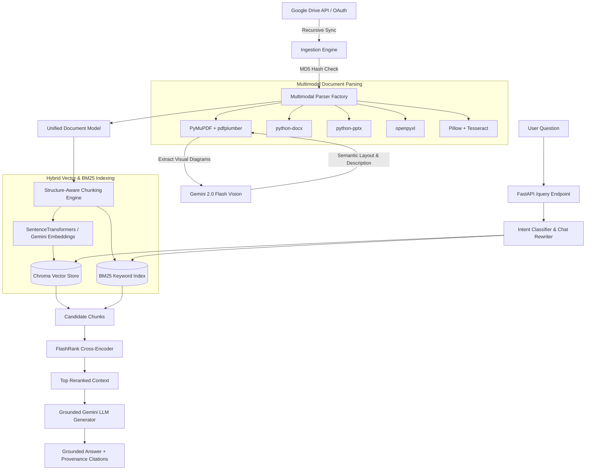

# Multimodal Google Drive RAG System

A production-quality **Retrieval-Augmented Generation (RAG) system in Python** built to answer complex technical and business questions accurately from documents stored in **Google Drive**.

The system is designed specifically for complex multimodal documents containing **text, tables, architecture diagrams, charts, screenshots, and multi-page PDFs**.

---

## 🌟 Key Architecture & Data Flow



---

## 🛠️ Technology Choices & Justification

| Component | Selected Technology | Selection Rationale |
| :--- | :--- | :--- |
| **Language & API** | Python 3.11+ / FastAPI / Pydantic v2 | Modern, high-performance async framework with strict data validation and OpenAPI support. |
| **Google Drive Integration** | Google Drive API v3 + OAuth 2.0 | Recursive folder discovery, MD5 hash tracking, and incremental change synchronization. |
| **Document Parsing** | PyMuPDF + pdfplumber + python-docx + openpyxl | Zero-cost, local parsing. `pdfplumber` provides high-precision table grid detection while `PyMuPDF` extracts high-res visual diagrams. |
| **Diagram Understanding** | Gemini 2.0 Flash Vision API | State-of-the-art visual reasoning that extracts architecture flow, node connections, component maps, and data relationships. |
| **Embeddings** | SentenceTransformers (`all-MiniLM-L6-v2`) | Fast local embedding execution without external rate-limit dependencies, pluggable with Google/OpenAI embedding APIs. |
| **Vector Store** | ChromaDB (with `VectorStore` interface) | Persistent file database with zero external setup. Decoupled via `VectorStore` base class for seamless migration to Pgvector / Qdrant. |
| **Hybrid Search** | Dense Cosine Vector + BM25 Sparse Search + RRF | Guarantees high recall for both semantic conceptual queries ("explain payment architecture") and exact keyword lookups ("Error code 504"). |
| **Reranking** | FlashRank (local Cross-Encoder) | High-speed local reranking (`ms-marco-MiniLM-L-6-v2`) without network latency. |
| **Grounded LLM** | Gemini 2.0 Flash (with OpenAI GPT-4o fallback) | High context windows, grounded generation, and strict citation formatting. |

---

## 📂 Project Structure

```
rag-system/
├── app/
│   ├── api/
│   │   └── routes.py            # FastAPI endpoints (/health, /drive/*, /documents/*, /ingestion/*, /query)
│   ├── core/
│   │   ├── config.py            # Configuration settings & environment variables
│   │   ├── logging.py           # Structured JSON logger
│   │   └── security.py          # Input sanitization & security helpers
│   ├── models/
│   │   ├── document.py          # Unified Document, Page, DocumentElement representations
│   │   ├── chunk.py             # Chunk & ChunkMetadata domain models
│   │   └── api.py               # Request & Response API schemas
│   ├── services/
│   │   └── gdrive.py            # Google Drive OAuth & file sync engine
│   ├── ingestion/
│   │   └── pipeline.py          # Async document ingestion & MD5 hash tracker
│   ├── parsing/
│   │   ├── base.py              # Base document parser interface
│   │   ├── pdf_parser.py        # PyMuPDF + pdfplumber table/diagram parser
│   │   ├── docx_parser.py       # DOCX structure & table parser
│   │   ├── pptx_parser.py       # PPTX slide & image parser
│   │   ├── xlsx_parser.py       # Openpyxl sheet & table matrix parser
│   │   ├── image_parser.py      # Standalone image & screenshot parser
│   │   └── vision_analyzer.py   # Gemini Vision API visual diagram analyzer
│   ├── chunking/
│   │   └── strategy.py          # Structure-aware chunking strategy
│   ├── embeddings/
│   │   └── service.py           # Pluggable Embedding service
│   ├── storage/
│   │   ├── base.py              # VectorStore abstract interface
│   │   ├── chroma_store.py      # ChromaDB & InMemory VectorStore
│   │   └── metadata_db.py       # SQLite metadata database
│   ├── retrieval/
│   │   ├── bm25.py              # BM25 Sparse Keyword Search Engine
│   │   ├── hybrid.py            # Hybrid Retriever with Reciprocal Rank Fusion (RRF)
│   │   └── query_processor.py   # Intent Classifier & Chat Context Rewriter
│   ├── reranking/
│   │   └── reranker.py          # FlashRank Cross-Encoder Reranker
│   ├── generation/
│   │   └── generator.py         # Grounded Generator with Citations
│   └── evaluation/
│       ├── evaluator.py         # Recall@K, MRR, Faithfulness calculator
│       └── benchmark.py         # Benchmark suite runner
├── tests/                       # Complete Pytest unit & integration test suite
├── scripts/
│   ├── run_ingestion.py         # Manual ingestion runner script
│   ├── run_evaluation.py        # Benchmark suite runner script
│   └── setup_oauth.py           # Google Drive OAuth setup helper
├── data/
│   ├── evaluation_dataset.json  # Benchmark dataset
│   └── sample_docs/             # Sample documents for sandbox ingestion
├── .env.example
├── requirements.txt
├── docker-compose.yml
├── Dockerfile
├── main.py                      # FastAPI Application Entrypoint
└── README.md
```

---

## ⚡ Quickstart & Installation

### 1. Prerequisites
- Python 3.11+
- Virtual environment (`venv`)

### 2. Setup Environment
```bash
cd rag-system
python3 -m venv .venv
source .venv/bin/activate
pip install -r requirements.txt
cp .env.example .env
```

### 3. Google Drive OAuth Setup (Optional for Live Drive)
If you have Google Cloud OAuth credentials:
```bash
# Save your downloaded OAuth client secret to data/credentials.json
python scripts/setup_oauth.py
```
*Note: If no Google Drive credentials are configured, the system automatically runs in **Sandbox Drive Mode**, ingesting documents from `data/sample_docs/`.*

---

## 🚀 Running the System

### Start the FastAPI Server
```bash
python main.py
```
The API server will start on `http://localhost:8000`. Interactive OpenAPI documentation is available at:
- **Swagger UI**: `http://localhost:8000/docs`
- **ReDoc**: `http://localhost:8000/redoc`

### Run Document Ingestion
```bash
python scripts/run_ingestion.py
```

### Run Benchmark Evaluation Suite
```bash
python scripts/run_evaluation.py
```

### Run Test Suite
```bash
pytest tests/
```

---

## 📊 API Reference

### Health
`GET /health`

### Google Drive & Ingestion
- `POST /drive/connect` — Connect to Google Drive or sandbox mode.
- `POST /drive/sync` — Trigger asynchronous ingestion sync job.
- `GET /drive/documents` — List synced drive documents.
- `GET /ingestion/status/{job_id}` — Check status and progress % of ingestion job.

### Document Management
- `GET /documents` — List ingested documents with page/chunk counts.
- `GET /documents/{document_id}` — Get document metadata.
- `DELETE /documents/{document_id}` — Delete document and vectors.

### RAG Query
`POST /query`

**Sample Request Body:**
```json
{
  "question": "Which product had the highest revenue and what was its growth rate?",
  "top_k": 5
}
```

**Sample Grounded Response:**
```json
{
  "question": "Which product had the highest revenue and what was its growth rate?",
  "answer": "Product B had the highest revenue of $15M with a growth rate of 18% [1].",
  "sources": [
    {
      "document_id": "doc_financial_report",
      "document_name": "financial_report.pdf",
      "page_number": 1,
      "section": "Product Revenue & Growth Analysis",
      "element_type": "table",
      "snippet": "| Product | Revenue | Growth |\n| Product A | $10M | 12% |\n| Product B | $15M | 18% |",
      "gdrive_url": "https://drive.google.com/file/d/...",
      "relevance_score": 0.942
    }
  ],
  "retrieval_time_ms": 14.2,
  "generation_time_ms": 230.5,
  "query_intent": "table_query"
}
```

---

## 🎯 How Multimodal Elements Are Processed

### 1. Structured Tables
- Detected grid boundaries are extracted using `pdfplumber` or `openpyxl`.
- Cells, rows, and header relationships are formatted into Markdown tables while preserving structured JSON matrices.
- Tables are kept intact as unified chunks during structure-aware chunking to prevent header loss.

### 2. Visual Diagrams & Flowcharts
- Diagrams are cropped and extracted as high-resolution images to `data/extracted_images/`.
- Processed with **Gemini 2.0 Flash Vision API** to generate rich semantic summaries, component lists, data flows, and arrow connections.
- The visual description is stored alongside nearby paragraph captions and indexed into vector search.

### 3. Provenance & Citations
- Every chunk tracks its original document filename, Google Drive URL, page number, section heading, and element type (`table`, `diagram`, `text`).
- Grounded prompt forces the LLM to provide exact citations for all claims.

---

## 🐳 Docker Deployment

To deploy using Docker Compose:
```bash
docker-compose up --build -d
```
The API will be available at `http://localhost:8000`.
