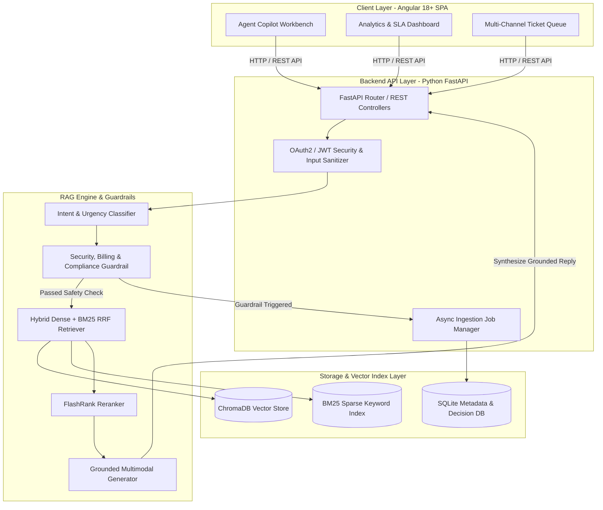
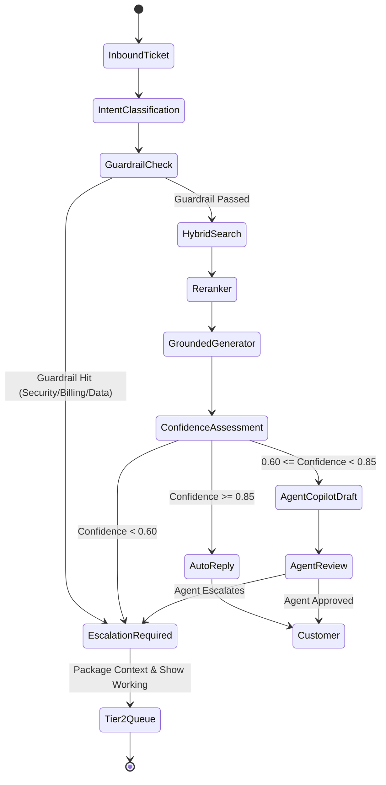

# System Architecture Document
## Production Multimodal RAG System & Support Copilot — CloudServe Solutions

- **Document Version**: 2.0
- **Architectural Stack**: Python 3.11+ / FastAPI / Angular 18+ SPA / ChromaDB / Gemini 2.5 & 1.5 LLM / Prometheus & Grafana

---

## 1. Executive System Topology

The CloudServe Intelligent Support System connects multi-channel inbound customer inquiries to a decoupled, high-performance RAG pipeline backed by a Modern Angular 18+ SPA Copilot workspace for support engineers.



---

## 2. Technology Stack Selection & Rationale

| Architectural Tier | Selected Technology | Alternative Evaluated | Selection Rationale |
| :--- | :--- | :--- | :--- |
| **Frontend SPA** | **Angular 18+ (Standalone Components, RxJS, NgRx)** | React / Vue | Enterprise-grade strict TypeScript typing, built-in reactive state management (RxJS), modular component structure, high performance for real-time ticket queues. |
| **Backend Framework** | **FastAPI (Python 3.11+)** | Flask / Express | Native async/await event loops, auto-generated OpenAPI documentation, Pydantic v2 data validation, ultra-fast latency. |
| **Document Parsing** | **PyMuPDF + pdfplumber + python-docx + openpyxl** | Unstructured / LlamaParse | Zero-cost, local parsing. `pdfplumber` preserves exact table grid boundaries while `PyMuPDF` extracts high-res visual diagrams without external API lock-in. |
| **Visual Diagram OCR** | **Google Gemini 2.5/2.0 Flash Vision API** | Plain Tesseract OCR | Diagrams require structural visual understanding (arrows, nodes, component flows). Gemini Vision extracts semantic component maps and data flow relationships. |
| **Embeddings** | **SentenceTransformers (`all-MiniLM-L6-v2`)** | OpenAI Embeddings | Fast local execution with zero API cost/rate limits; cleanly abstracted via `EmbeddingService` protocol. |
| **Vector Store** | **ChromaDB** | PostgreSQL + pgvector / Qdrant | Local file-backed vector persistence. Decoupled via `VectorStore` abstract class for seamless production migration. |
| **Sparse Keyword Search** | **BM25 (`rank_bm25`)** | Elasticsearch | High precision for exact technical term lookups (error codes, SDK method names) with zero infrastructure complexity. |
| **Hybrid Search Fusion** | **Reciprocal Rank Fusion (RRF, $k=60$)** | Score Normalization | Combines vector cosine similarity and BM25 keyword rankings without requiring score range calibration. |
| **Reranking Engine** | **FlashRank (ONNX Cross-Encoder)** | Cohere Rerank API | Local cross-encoder re-scoring (`ms-marco-MiniLM-L-6-v2`) for ultra-fast candidate refinement. |
| **LLM Generator** | **Google Gemini 2.5 Flash** (with OpenAI fallback) | Llama 3 8B Local | High context window, grounded generation, and strict citation formatting. |
| **Observability** | **Prometheus + Grafana** | Datadog | Standard open-source metrics monitoring tracking query latency, guardrail block counts, and FCR metrics. |

---

## 3. Frontend Architecture (Angular 18+ SPA)

The frontend is built as a single-page application (SPA) using Angular 18+ featuring standalone components, reactive forms, and RxJS state management.

```
src/app/
├── core/
│   ├── services/
│   │   ├── api.service.ts          # HttpClient wrapper for FastAPI REST endpoints
│   │   ├── ticket.service.ts       # Ticket state & polling management
│   │   └── auth.service.ts         # JWT / OAuth2 auth state guard
│   ├── guards/
│   │   └── auth.guard.ts           # Route navigation guards
│   └── models/
│       ├── ticket.model.ts         # TypeScript interface for Tickets & Channels
│       ├── query.model.ts          # Query Request/Response models
│       └── citation.model.ts       # Citation & KB passage models
├── features/
│   ├── ticket-queue/               # Multi-channel ticket list with channel filters
│   │   ├── ticket-queue.component.ts
│   │   └── ticket-queue.component.html
│   ├── copilot-workbench/          # Agent Copilot Workbench (Dual Pane)
│   │   ├── copilot-workbench.component.ts
│   │   └── copilot-workbench.component.html
│   └── analytics-dashboard/        # Real-time FCR & SLA analytics dashboard
│       ├── analytics-dashboard.component.ts
│       └── analytics-dashboard.component.html
└── shared/
    ├── components/
    │   ├── confidence-meter/       # Visual confidence indicator (Red/Yellow/Green)
    │   └── citation-viewer/        # Clickable KB passage popover drawer
    └── pipes/
        └── time-ago.pipe.ts
```

### Key Angular Component Responsibilities:
1. **Ticket Queue Component**: Filters incoming tickets by channel (Email, Chat, API Comments, Forum), priority, and SLA expiration timer.
2. **Copilot Workbench Component**: Displays customer query alongside AI-generated draft response, confidence score meter, guardrail status badges, and interactive cited KB article links.
3. **1-Click Agent Action Handlers**:
   - `Approve & Send`: Sends response to customer and marks ticket resolved (FCR + 1).
   - `Edit & Send`: Opens inline Markdown editor for Tier 1 agent modifications before sending.
   - `Escalate to Tier 2`: Compiles structured escalation payload and routes ticket to Tier 2 queue.

---

## 4. Backend Architecture & API Flow (Python FastAPI)

The backend follows clean layered architecture:
`API Routes -> Services -> Domain Pipeline -> Storage Layer`.

```
app/
├── api/
│   └── routes.py             # FastAPI REST endpoint routes
├── core/
│   ├── config.py             # Pydantic BaseSettings (.env loading)
│   ├── logging.py            # JSON Structured logger
│   └── security.py           # Input sanitization & HTML strip
├── models/
│   ├── document.py           # Unified Document, Page, DocumentElement models
│   ├── chunk.py              # Chunk & ChunkMetadata domain models
│   └── api.py                # Request/Response API schemas
├── services/
│   └── gdrive.py             # Google Drive OAuth & Sandbox Drive service
├── ingestion/
│   └── pipeline.py           # Async document ingestion & MD5 hash tracking
├── parsing/
│   ├── base.py               # Abstract Base Parser
│   ├── pdf_parser.py         # PyMuPDF + pdfplumber parser
│   ├── docx_parser.py        # python-docx parser
│   ├── pptx_parser.py        # python-pptx parser
│   ├── xlsx_parser.py        # openpyxl sheet matrix parser
│   ├── image_parser.py       # Pillow + Tesseract image parser
│   └── vision_analyzer.py    # Gemini Vision API visual diagram analyzer
├── chunking/
│   └── strategy.py           # Structure-aware chunking strategy
├── embeddings/
│   └── service.py            # SentenceTransformers / Gemini / OpenAI service
├── storage/
│   ├── base.py               # VectorStore abstract interface
│   ├── chroma_store.py       # ChromaDB persistent store
│   └── metadata_db.py        # SQLite metadata & decision database
├── retrieval/
│   ├── bm25.py               # BM25 Sparse Keyword Search Engine
│   ├── hybrid.py             # Dense + BM25 Hybrid RRF Retriever
│   └── query_processor.py    # Intent Classifier & Chat Context Rewriter
├── reranking/
│   └── reranker.py           # FlashRank Reranker
├── generation/
│   └── generator.py          # Grounded Generator with Citations
└── evaluation/
    ├── evaluator.py          # Recall@K, MRR, Faithfulness calculator
    └── benchmark.py          # Benchmark suite runner
```

---

## 5. Decision & Escalation Matrix



### Escalation Package Structure (Tier 2 Handoff):
When a ticket is escalated to Tier 2, the system automatically packages:
1. **Original Customer Inquiry**.
2. **Intent & Topic Category** (e.g., `authentication`, `deployment`).
3. **Guardrail Trigger Reason** (e.g., `SECURITY_GUARDRAIL_BLOCKED`, `LOW_RETRIEVAL_CONFIDENCE`).
4. **Top 3 Searched Knowledge Base Articles** with exact passages.
5. **AI Draft Response & Specific Uncertainty Notes**.

---

## 6. Observability & Monitoring Framework

The backend exports Prometheus metrics at `/metrics`:
- `rag_queries_total{channel, intent}` — Counter of incoming queries.
- `rag_query_latency_seconds` — Histogram of retrieval & generation times.
- `rag_guardrail_blocks_total{reason}` — Counter of guardrail blocks.
- `rag_fcr_success_total` — Counter of First Contact Resolutions.
- `rag_retrieval_recall` — Gauge of Recall@5 evaluation metrics.
