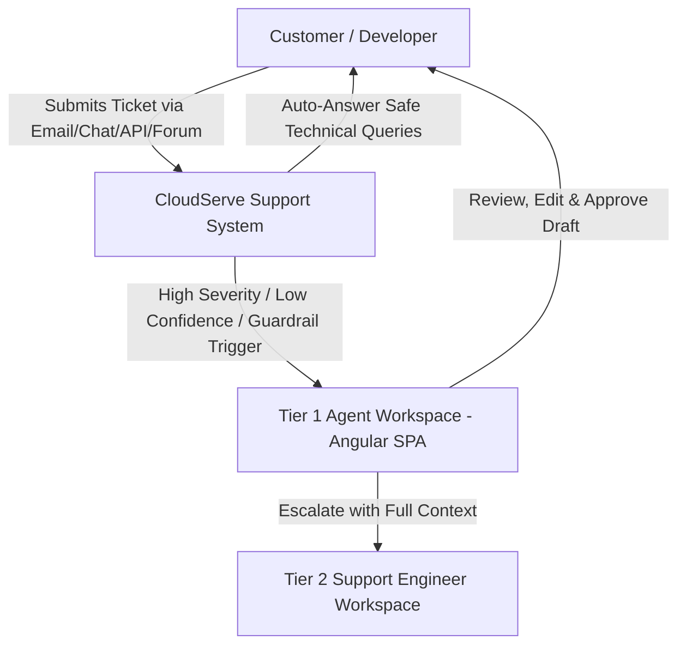

# Product Requirements Document (PRD)
## Intelligent Customer Support Automation System — CloudServe Solutions

- **Document Version**: 2.0 (Post-Build Revised)
- **Author**: Lead Forward Deployed AI Engineer
- **Target Stack**: Python 3.11+ / FastAPI / Modern Angular 18+ SPA / ChromaDB / Gemini 2.5 & 1.5 LLM

---

## 1. Problem Framing & Discovery Evidence

### 1.1 Executive Problem Statement
CloudServe Solutions receives over **500 customer support tickets per week** across 4 distinct channels (Email, Live Chat, API Doc Comments, Community Forum) handled by 6 support agents. The company faces three critical operational failures:
1. **SLA Breach**: First response time averages **8 to 12 hours** against a promised 2-hour SLA.
2. **Escalation Inefficiency**: First Contact Resolution (FCR) is **42%** (industry benchmark: 65%). **50% of Tier 2 escalations** are simple issues that Tier 1 could resolve if provided with confidence and accurate knowledge base grounding. Each escalation costs 4x a Tier 1 resolution.
3. **Keyword Search Failure & Snippet Drift**: Agents rely on outdated, unverified personal snippet files because existing internal search matches only exact terms ("container health check" vs "deployment dying").

---

### 1.2 Discovery Evidence Traceability Matrix

| Discovery Source | Key Evidence / Insight | Product Requirement Generated |
| :--- | :--- | :--- |
| **Marcus Adeyemi** *(Head of Support)* | Escalations cost 4x Tier 1; FCR is 42% vs 65% benchmark; response time is 8-12 hours vs 2h SLA. | **REQ-001**: Automated intent & routing classification. **REQ-002**: First-response draft generation within < 10 seconds. |
| **Sofia** *(Tier 1 Agent)* | Afraid of auto-sending wrong answers; non-native English tickets take longer; wants Copilot mode with draft + cited KB link. | **REQ-003**: Agent-in-the-loop Copilot interface in Angular SPA. **REQ-004**: Multilingual intent normalization & entity extraction. |
| **Daniel Okonkwo** *(Tier 2 Engineer)* | 50% of escalations are simple KB lookups; escalations lack context; risks in security, billing, and data residency. | **REQ-005**: Context-rich escalation payloads with decision logs. **REQ-006**: Guardrails blocking auto-replies on Security, Billing, and Data Location. |
| **Ines Varga** *(Technical Writer)* | 29 verified KB articles (`documentation.json`) exist but keyword search fails; agents use unverified private snippets. | **REQ-007**: Multimodal Hybrid Semantic Search (BM25 + Dense Vector + RRF) strictly grounded on the 29 KB articles. |
| **Ravi Menon** *(Customer)* | Waiting cost depends on ticket urgency; expects transparency on AI involvement; wants exact citations. | **REQ-008**: Dynamic SLA & Urgency Classifier. **REQ-009**: Explicit AI disclosure and clickable KB source citations down to article ID and section. |

---

## 2. Target User Personas & Roles

1. **Tier 1 Support Agent**: Uses the Angular SPA Copilot to view incoming tickets, inspect AI-generated response drafts alongside confidence scores and cited KB passages, edit/approve responses, or escalate with 1-click.
2. **Tier 2 Support Engineer**: Receives structured escalation packages containing ticket summary, intent, confidence score, searched KB articles, and reason for escalation.
3. **Support Operations / Lead Engineer**: Monitors system performance, FCR rates, SLA compliance, guardrail block counts, and RAG retrieval accuracy via Prometheus & Grafana dashboards.
4. **End Customer / Developer**: Receives rapid, highly accurate, document-grounded solutions with explicit citations and AI disclosure.

---

## 3. Functional Requirements

### 3.1 Data Ingestion & Knowledge Base Management
- **REQ-ING-01**: Ingest Google Drive documents and support local directory fallback (`data/sample_docs/`), supporting PDF, DOCX, PPTX, XLSX, and standalone images.
- **REQ-ING-02**: Perform MD5 checksum & modified timestamp tracking in SQLite to skip unchanged documents during synchronization.
- **REQ-ING-03**: Preserve document hierarchy (Doc -> Section -> Subsection -> Paragraph) and structure-aware table matrices and visual diagram descriptions.

### 3.2 Multimodal Processing & Indexing
- **REQ-IDX-01**: Structure-Aware Chunking — keep tables intact as single Markdown blocks with column headers; bind visual diagram descriptions with nearby text.
- **REQ-IDX-02**: Hybrid Retrieval — combine Dense Cosine Similarity Search (ChromaDB) with BM25 Keyword Search using Reciprocal Rank Fusion ($k=60$).
- **REQ-IDX-03**: Cross-Encoder Reranking — rerank top 20 retrieved candidate chunks to produce top 5 high-relevance passages.

### 3.3 Classification, Guardrails & Escalation Routing
- **REQ-GRD-01 (Confidence Thresholding)**:
  - `Confidence >= 0.85`: Auto-reply candidate / One-click agent approval.
  - `0.60 <= Confidence < 0.85`: Draft generated for Tier 1 Agent review in Angular SPA.
  - `Confidence < 0.60`: Direct escalation to Tier 2 with structured context summary.
- **REQ-GRD-02 (Hard Guardrail Blocks)**: Unconditionally block automated resolution and escalate to human agents for:
  1. *Security & Account Compromise* (Password resets without identity verification, SAML breach).
  2. *Billing Disputes & Contracts* (Refund requests, SLA penalties, pricing changes).
  3. *Data Location & Compliance* (GDPR, data residency, legal inquiries).
  4. *Novel / Out-of-Scope Topics* (Feature requests, roadmap dates).

### 3.4 Grounded Generation & Citation System
- **REQ-GEN-01**: Enforce strict factual grounding — if retrieved context does not contain the answer, explicitly state: *"The retrieved documents do not contain enough information to answer this question."*
- **REQ-GEN-02**: Include verifiable citations for every claim: `Source: [Doc ID: Title](url) — Page X, Section Y`.

### 3.5 Angular 18+ Frontend Application
- **REQ-UI-01**: Modern, responsive Angular SPA featuring:
  - **Ticket Queue Dashboard**: Real-time channel filters (Email, Chat, API Docs, Forum), priority/urgency badges, and SLA timers.
  - **Copilot Workbench**: Dual-pane view displaying customer query, AI draft response, confidence score meter, guardrail triggers, and interactive cited KB passages.
  - **1-Click Agent Actions**: `Approve & Send`, `Edit & Send`, `Escalate to Tier 2`.
  - **Analytics & Governance View**: Real-time metrics on FCR, response time reduction, guardrail hits, and evaluation feedback.

---

## 4. Non-Functional Requirements (NFRs)

- **NFR-PERF-01 (Latency)**: API retrieval & draft generation response time $\le 3.5\text{ seconds}$ per query.
- **NFR-ACC-01 (Retrieval Accuracy)**: Recall@5 $\ge 85\%$, MRR $\ge 0.75$ on technical corpus queries.
- **NFR-SEC-01 (Security)**: OAuth 2.0 / JWT authentication for API endpoints, strict input sanitization against prompt injection, zero plaintext API keys in client bundles or logs.
- **NFR-AVAIL-01 (Reliability)**: System operates in fallback mode (local BM25 + deterministic synthesis) if external LLM APIs experience downtime.
- **NFR-OBS-01 (Observability)**: Prometheus metrics exported at `/metrics` tracking query count, latency histogram, retrieval recall, guardrail block events, and LLM API costs.

---

## 5. Scope Boundaries

### In Scope
- Full RAG pipeline covering 29 CloudServe KB articles + technical docx/pdf documents.
- Multi-channel ticket processing (Email, Live Chat, API Comments, Forum).
- Hybrid search, structure-aware chunking, reranking, guardrails, and citation engine.
- FastAPI REST backend + Modern Angular 18+ SPA Copilot dashboard.
- Automated evaluation framework & Prometheus/Grafana governance framework.

### Deliberately Out of Scope
- Direct voice call processing.
- Automated processing of financial refunds or contract modifications without human signature.
- Training custom LLMs from scratch (uses Gemini / OpenAI APIs with SentenceTransformers).

---

## 6. Success Metrics & Targets

| Metric | Baseline (Current) | Target Threshold | Target Metric Type |
| :--- | :--- | :--- | :--- |
| **First Response Time** | 8 – 12 Hours | **< 15 Minutes** (Auto) / **< 1 Hour** (Copilot) | SLA Business Target |
| **First Contact Resolution (FCR)** | 42% | **$\ge$ 65%** | FCR Business Target |
| **Tier 2 Unnecessary Escalation Rate** | 50% | **< 15%** | Efficiency Target |
| **RAG Retrieval Recall@5** | N/A | **$\ge$ 85%** | Technical Target |
| **Answer Faithfulness (No Hallucinations)** | N/A | **$\ge$ 90%** | Governance Target |
| **Customer Satisfaction (CSAT)** | 3.2 / 5.0 | **$\ge$ 4.5 / 5.0** | Customer Target |
