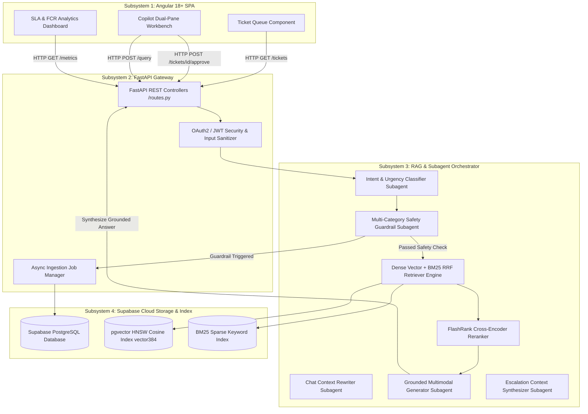

# Stage 3: System Architecture & Subagent Prompt Synthesis Document
## CloudServe Support Automation System — Architectural Blueprint Report

---

### Document Metadata & Stage Information

| Field | Value |
| :--- | :--- |
| **Document Stage** | **Stage 3: System Architecture & Subagent Prompt Design** |
| **Author** | Lead Forward Deployed AI Engineer |
| **Target Architecture** | Python 3.11+ FastAPI / Angular 18+ SPA / Supabase PostgreSQL + `pgvector` / Gemini 2.5 Flash |
| **Primary Artifacts** | [`hld.md`](file:///Users/aman/AgentAi/untitled%20folder/hld.md), [`lld.md`](file:///Users/aman/AgentAi/untitled%20folder/lld.md), [`agent.md`](file:///Users/aman/AgentAi/untitled%20folder/agent.md) |
| **Status** | **Approved & Fully Aligned** |

---

## 1. Executive System Topology & Subsystem Boundaries

The CloudServe Intelligent Support Automation System is built as a **Modular Monolith API Backend** in Python FastAPI paired with a **Modern Reactive Single-Page Application** in Angular 18+ and backed by **Supabase PostgreSQL** with `pgvector` HNSW vector indexing.

---

## 2. Low-Level Database Schema & Vectors (Supabase PostgreSQL)

The persistence layer relies on **5 PostgreSQL tables** deployed on Supabase:

1. **`documents`**: Ingested document metadata (file name, checksums, page count, sync status).
2. **`document_chunks`**: Text chunks, section titles, page numbers, element types (`text`, `table`, `diagram`) with **HNSW `vector(384)` index**.
3. **`ingestion_jobs`**: Tracking async ingestion jobs, progress %, files processed/failed, and error logs.
4. **`tickets`**: Multi-channel customer support ticket queue (Email, Chat, API Docs, Forum) with urgency, customer tier, status, and AI draft responses.
5. **`decision_logs`**: Governance audit trail tracking AI intent classification, confidence scores, guardrail triggers, and actions taken.

### Stored Procedure RPC Function (`match_document_chunks`):
Sub-millisecond similarity search executing Cosine Distance calculation ($1 - (\text{embedding} \Leftrightarrow \text{query\_embedding})$) directly in PostgreSQL memory.

---

## 3. Versioned Subagent Architecture ([`agent.md`](file:///Users/aman/AgentAi/untitled%20folder/agent.md))

The system orchestrates **5 specialized subagents** with strict JSON schemas and system prompts:

| Subagent Name | Role & Specification | Version | Output Schema |
| :--- | :--- | :---: | :--- |
| **`classifier_agent`** | Classifies technical intent, detects sentiment, extracts entity names, and assigns urgency. | `v2.1` | `{"intent": str, "urgency": str, "entities": dict, "confidence": float}` |
| **`guardrail_agent`** | Evaluates safety risk against Security, Billing, Data Residency, and Compliance categories. | `v2.1` | `{"pass_guardrail": bool, "risk_category": str, "reason": str}` |
| **`rewriter_agent`** | Rewrites conversational follow-up questions into standalone search queries. | `v2.1` | `{"standalone_query": str, "history_summarized": bool}` |
| **`generator_agent`** | Generates factual answers grounded strictly in retrieved KB passages with exact citations. | `v2.1` | `{"answer": str, "sources": list, "ungrounded": bool}` |
| **`escalation_agent`** | Synthesizes context-rich escalation packages for Tier 2 handoff when confidence < 0.60. | `v2.1` | `{"ticket_summary": str, "searched_passages": list, "uncertainty_notes": str}` |

---

## 4. Mathematical Search Formulations

### 4.1 Dense Cosine Similarity
$$\text{Similarity}(\vec{q}, \vec{c}) = \frac{\vec{q} \cdot \vec{c}}{\|\vec{q}\| \|\vec{c}\|}$$

### 4.2 Sparse BM25 Okapi Scoring
$$\text{Score}_{BM25}(D, Q) = \sum_{i=1}^{n} \text{IDF}(q_i) \cdot \frac{f(q_i, D) \cdot (k_1 + 1)}{f(q_i, D) + k_1 \cdot \left(1 - b + b \cdot \frac{|D|}{\text{avgdl}}\right)}$$

### 4.3 Reciprocal Rank Fusion (RRF, $k=60, \alpha=0.5$)
$$\text{RRF\_Score}(d) = 0.5 \cdot \frac{1}{60 + r_{\text{vec}}(d)} + 0.5 \cdot \frac{1}{60 + r_{\text{bm25}}(d)}$$

---

## 5. Stage 3 Deliverables Checklist

- ✅ High-Level Design document updated: [`hld.md`](file:///Users/aman/AgentAi/untitled%20folder/hld.md)
- ✅ Low-Level Design document updated: [`lld.md`](file:///Users/aman/AgentAi/untitled%20folder/lld.md)
- ✅ Subagent Prompt Library created: [`agent.md`](file:///Users/aman/AgentAi/untitled%20folder/agent.md)
- ✅ Stage 3 Architecture Synthesis deliverable created: [`stage3_architecture_synthesis.md`](file:///Users/aman/AgentAi/untitled%20folder/stage3_architecture_synthesis.md).
