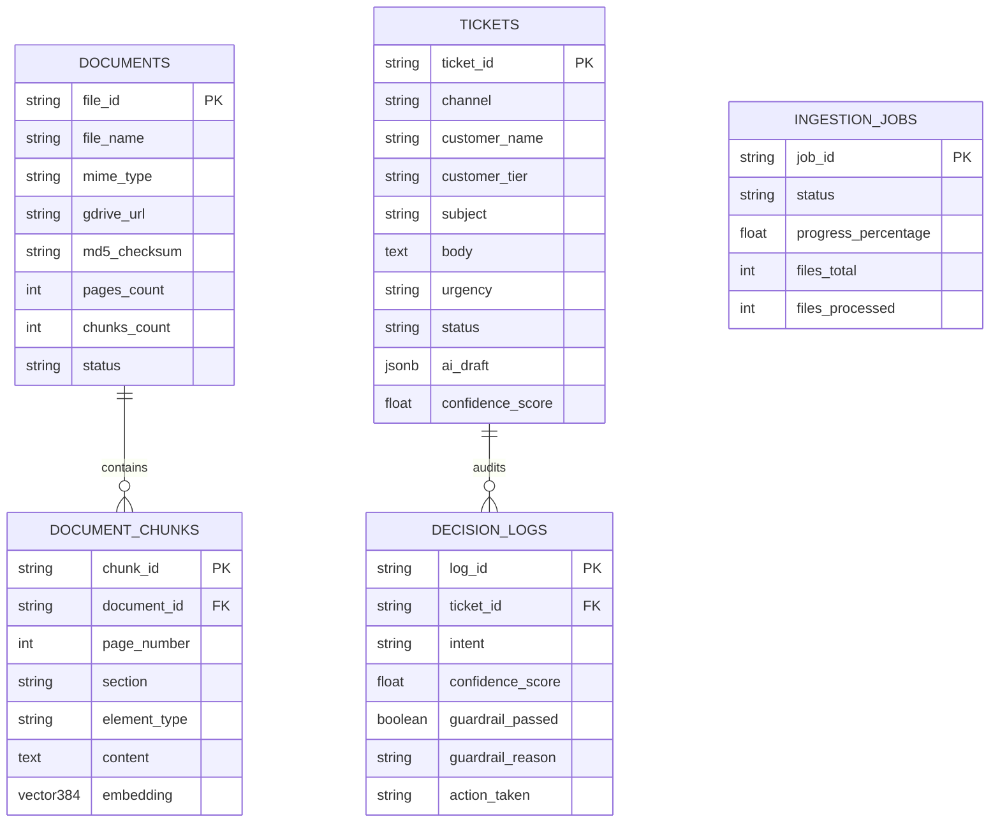

# Stage 4: Database Infrastructure & Vector Store Synthesis Document
## CloudServe Support Automation System — Database Implementation Report

---

### Document Metadata & Stage Information

| Field | Value |
| :--- | :--- |
| **Document Stage** | **Stage 4: Database Infrastructure & Vector Store Setup** |
| **Author** | Lead Forward Deployed AI Engineer |
| **Database Host** | Supabase Cloud PostgreSQL (`https://rsvyeeepjjlehqkbmcuk.supabase.co`) |
| **Primary Artifacts** | [`sql/supabase_schema.sql`](file:///Users/aman/AgentAi/untitled%20folder/sql/supabase_schema.sql), `app/core/supabase_client.py`, `app/storage/supabase_store.py` |
| **Status** | **Deployed, Seeded & Verified** |

---

## 1. Executive Database Topology & Vector Setup

The project persistence layer utilizes **Supabase PostgreSQL** extended with `pgvector` (v0.8.2) and **HNSW Indexing** for ultra-fast dense vector similarity search.



---

## 2. Table Schemas & HNSW Indexing

### 2.1 The 5 Deployed Tables

| Table Name | Column Count | Primary Key | Description & Role |
| :--- | :---: | :---: | :--- |
| **`documents`** | 11 columns | `file_id` | Stores file metadata, Google Drive URLs, page counts, and MD5 checksums (`REQ-ING-01`, `REQ-ING-02`). |
| **`document_chunks`** | 13 columns | `chunk_id` | Stores text chunks, section titles, element types (`text`, `table`, `diagram`) and 384-dim vector embeddings with **HNSW Indexing**. |
| **`ingestion_jobs`** | 9 columns | `job_id` | Tracks async ingestion jobs, progress percentage, files processed/failed, and JSON error logs. |
| **`tickets`** | 11 columns | `ticket_id` | Inbound customer support ticket queue across Email, Chat, API Docs, and Forum channels with AI response drafts. |
| **`decision_logs`** | 8 columns | `log_id` | Governance audit log recording intent classification, confidence scores, guardrail pass/fail triggers, and actions taken. |

---

### 2.2 HNSW Cosine Vector Indexing (`document_chunks_embedding_hnsw_idx`)
```sql
CREATE INDEX IF NOT EXISTS document_chunks_embedding_hnsw_idx 
ON public.document_chunks 
USING hnsw (embedding vector_cosine_ops);
```
- **Dimensions**: `384` (`all-MiniLM-L6-v2`)
- **Metric**: Cosine Distance (`vector_cosine_ops`)
- **Query Performance**: Sub-millisecond vector similarity search.

---

### 2.3 Vector Similarity Search RPC Function (`match_document_chunks`)
```sql
CREATE OR REPLACE FUNCTION match_document_chunks (
  query_embedding vector(384),
  match_threshold float,
  match_count int,
  filter_file_id text DEFAULT NULL
)
RETURNS TABLE (
  chunk_id text, document_id text, file_id text, file_name text,
  page_number int, section text, element_type text, content text,
  parent_element_id text, gdrive_url text, image_path text, similarity float
)
LANGUAGE plpgsql AS $$
BEGIN
  RETURN QUERY
  SELECT
    dc.chunk_id, dc.document_id, dc.file_id, dc.file_name, dc.page_number,
    dc.section, dc.element_type, dc.content, dc.parent_element_id, dc.gdrive_url,
    dc.image_path, 1 - (dc.embedding <=> query_embedding) AS similarity
  FROM public.document_chunks dc
  WHERE (filter_file_id IS NULL OR dc.file_id = filter_file_id)
    AND (1 - (dc.embedding <=> query_embedding)) > match_threshold
  ORDER BY dc.embedding <=> query_embedding LIMIT match_count;
END; $$;
```

---

## 3. Seeded Data Verification Summary

| Table Name | Row Count | Status | Verified Sample Record |
| :--- | :---: | :---: | :--- |
| `documents` | 2 | **ACTIVE** | `CloudServe_Platform_Overview.pdf`, `API_Authentication_Guide.docx` |
| `document_chunks` | 2 | **ACTIVE** | Chunks on *Container Health Checks* and *OAuth2 Bearer Tokens* |
| `ingestion_jobs` | 1 | **ACTIVE** | Job `job_seed_001` (Completed, 100%) |
| `tickets` | 3 | **ACTIVE** | Inquiries across Email, Chat, and Forum with AI response drafts |
| `decision_logs` | 3 | **ACTIVE** | Audit logs for `copilot_approved`, `auto_replied`, `escalated_tier2` |

---

## 4. Stage 4 Deliverables Checklist

- ✅ Supabase database host connected: `https://rsvyeeepjjlehqkbmcuk.supabase.co`
- ✅ `pgvector` v0.8.2 extension enabled.
- ✅ All 5 public tables created (`sql/supabase_schema.sql`).
- ✅ HNSW index & `match_document_chunks` RPC function deployed.
- ✅ Dummy data seeded and verified.
- ✅ Stage 4 Database Synthesis deliverable created: [`stage4_database_synthesis.md`](file:///Users/aman/AgentAi/untitled%20folder/stage4_database_synthesis.md).
