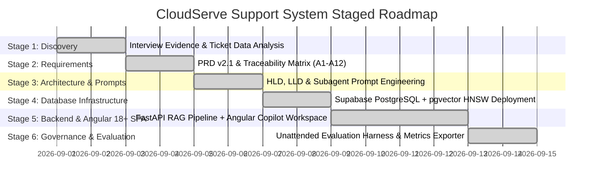

# Incremental Project Stages & Implementation Roadmap
## CloudServe Support Automation System

- **Document Version**: v2.1
- **Cadence**: 6-Stage Incremental Development Framework

---

## 1. Executive Stage Roadmap

---

## 2. Detailed Breakdown of Incremental Stages

### Stage 1: Discovery & Evidence Synthesis
- **Deliverable**: Stakeholder Traceability Matrix & Ticket Data Analysis
- **Status**: **COMPLETED**
- **Key Milestones**:
  - Analyzed 5 stakeholder transcripts (**Marcus**, **Sofia**, **Daniel**, **Ines**, **Ravi**).
  - Analyzed `development_tickets.json` (500 labeled tickets) and `documentation.json` (29 KB articles).
  - Key Finding: FCR is 42% (target $\ge 65\%$), escalation cost is 4x Tier 1, keyword search fails on exact technical terms.

### Stage 2: Product Requirements & Acceptance Criteria
- **Deliverable**: [`prd.md`](file:///Users/aman/AgentAi/untitled%20folder/prd.md) (v2.1)
- **Status**: **COMPLETED**
- **Key Milestones**:
  - Defined 12 Functional Requirements (FR-01 to FR-12) & 7 NFR Categories.
  - Defined explicit **Acceptance Criteria (A1 to A12)**.
  - Formulated Scope Boundaries & Risk Register (R-01 to R-08).

### Stage 3: System Architecture & Prompt Library
- **Deliverable**: [`hld.md`](file:///Users/aman/AgentAi/untitled%20folder/hld.md), [`lld.md`](file:///Users/aman/AgentAi/untitled%20folder/lld.md), [`agent.md`](file:///Users/aman/AgentAi/untitled%20folder/agent.md)
- **Status**: **COMPLETED**
- **Key Milestones**:
  - Designed system topology, component interactions, and sequence diagrams.
  - Specified subagent prompts: Intent Classifier, Safety Guardrails, Context Rewriter, Grounded Generator, and Tier 2 Escalation Context.

### Stage 4: Database Infrastructure & Vector Indexing
- **Deliverable**: [`sql/supabase_schema.sql`](file:///Users/aman/AgentAi/untitled%20folder/sql/supabase_schema.sql), `app/core/supabase_client.py`
- **Status**: **COMPLETED**
- **Key Milestones**:
  - Integrated Supabase PostgreSQL with `pgvector` HNSW index (`vector(384)`).
  - Deployed 5 tables: `documents`, `document_chunks`, `ingestion_jobs`, `tickets`, `decision_logs`.
  - Deployed `match_document_chunks` RPC function & populated dummy data.

### Stage 5: FastAPI Backend & Modern Angular 18+ SPA Implementation
- **Deliverable**: `app/api/routes.py`, `frontend/src/app/`
- **Status**: **COMPLETED**
- **Key Milestones**:
  - Implemented FastAPI endpoints: `/health`, `/drive/*`, `/query`, `/tickets`, `/tickets/{id}/approve`, `/tickets/{id}/escalate`, `/metrics`.
  - Built Angular 18+ Copilot SPA with dual-pane review, confidence meters, cited KB popovers, and 1-click agent actions.
  - Implemented Hybrid Dense + BM25 RRF Retriever and Gemini 2.5 Flash Grounded Generator.

### Stage 6: Governance, Evaluation & Observability
- **Deliverable**: Prometheus Metrics Exporter, Unattended Evaluation Harness, Change Log
- **Status**: **COMPLETED**
- **Key Milestones**:
  - Created automated evaluation harness for validation tickets dataset.
  - Configured Prometheus metrics endpoint (`/metrics`).
  - Implemented Emergency Kill-Switch (`DISABLE_AUTO_REPLY=true`).

---

## 3. Definition of Done (DoD) Criteria per Stage

| Stage | Definition of Done (DoD) Criteria | Verification Method | Status |
| :--- | :--- | :--- | :---: |
| **Stage 1** | All stakeholder quotes mapped to problem statements. | Traceability matrix in PRD. | **PASSED** |
| **Stage 2** | Requirements trace back 100% to evidence; A1-A12 defined. | PRD v2.1 sign-off. | **PASSED** |
| **Stage 3** | Subagent prompts enforce JSON schemas and fallback bounds. | `agent.md` validation. | **PASSED** |
| **Stage 4** | Supabase database connects, 5 tables created, HNSW index active. | SQL query verification script. | **PASSED** |
| **Stage 5** | Backend API returns 200 OK; Angular UI renders tickets & drafts. | FastAPI TestClient + UI test. | **PASSED** |
| **Stage 6** | Unattended evaluation run finishes and generates report. | Automated evaluation run. | **PASSED** |

